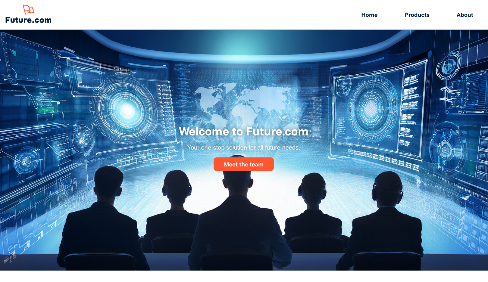
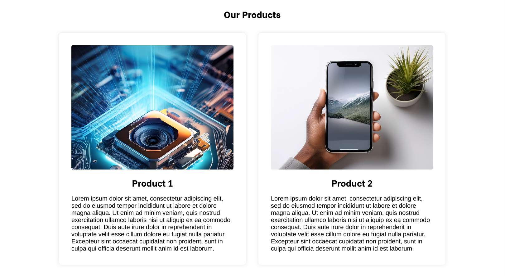
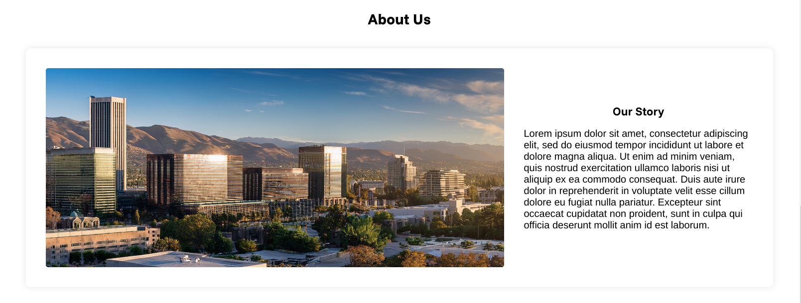
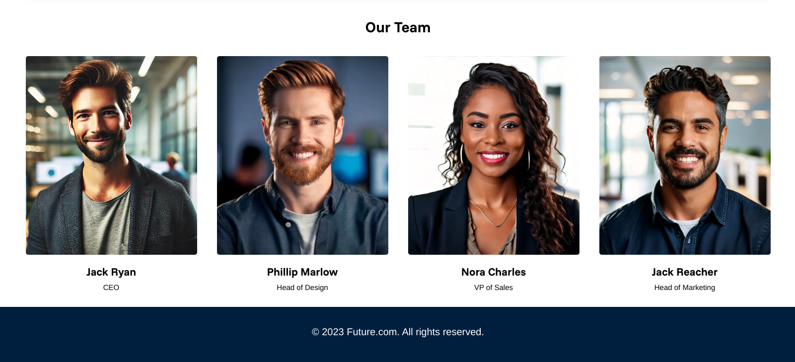
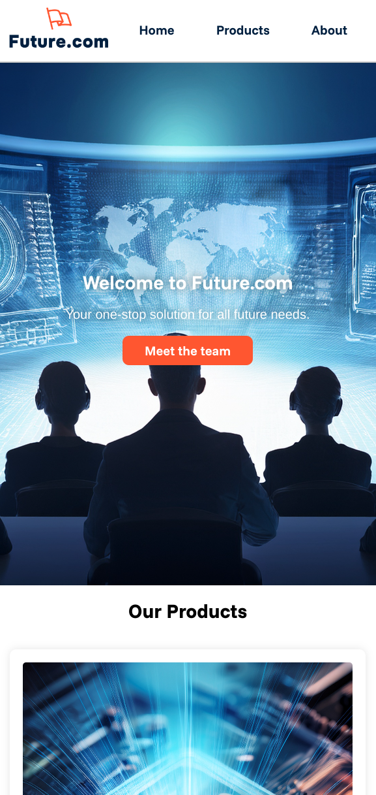

# Flexbox Business Site

This project is part of the Codecademy Full Stack Engineer course, specifically the HTML and CSS module. The project demonstrates the use of Flexbox to create a responsive generic business website. I made up a business called **"Future.com"** that is suitably generic and corporate. The images are all generated using ChatGPT 4o and Adobe Firefly Image generation

## Project Structure

The project has the following structure:

  Flexbox-Business-site/ 
    ├── favicon.ico 
    ├── images/ 
      │ ├── building_the_future_1.jpg 
      │ ├── ceo_headshot.jpg 
      │ ├── logo.png 
      │ ├── masthead_companyHQ.jpg 
      │ ├── products_1.jpg 
      │ ├── smartphone_image_future.jpg 
      │ ├── vp_design_headhsot.jpg 
      │ ├── vp_marketing_headshot.jpg 
      │ ├── vp_sales_headshot.jpg 
    ├── index.html 
    └── styles.css

## Files

- **index.html**: The main HTML file that contains the structure of the website.
- **styles.css**: The CSS file that contains the styles for the website.
- **favicon.ico**: The favicon for the website.
- **images/**: A directory containing images used in the website.

## Features

- **Responsive Navigation Bar**: A navigation bar that adjusts its layout based on the screen size.
- **Call to Action Section**: A visually appealing section with a background image and a call to action button.
- **Products Section**: A section showcasing the products offered by the business.
- **About Us Section**: A section that provides information about the business and its team members.
- **Footer**: A footer with the business's copyright information.

## Technologies Used

- **HTML**: For the structure of the website.
- **CSS**: For styling the website, including the use of Flexbox for layout.
- **Google Fonts**: For custom fonts used in the website.

## How to Run

1. Clone the repository to your local machine.
2. Open the `index.html` file in your web browser to view the website.

## Screenshots

### Wide Screenshots

### Mobile Screenshots

## License

This project is licensed under the MIT License.

## Acknowledgements

- Codecademy for providing the project and course materials.
- Google Fonts for the custom fonts used in the project.
- ChatGPT and Adobe Firefly for images used in the project
